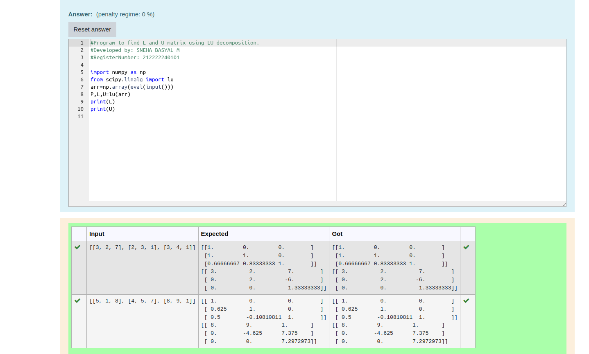
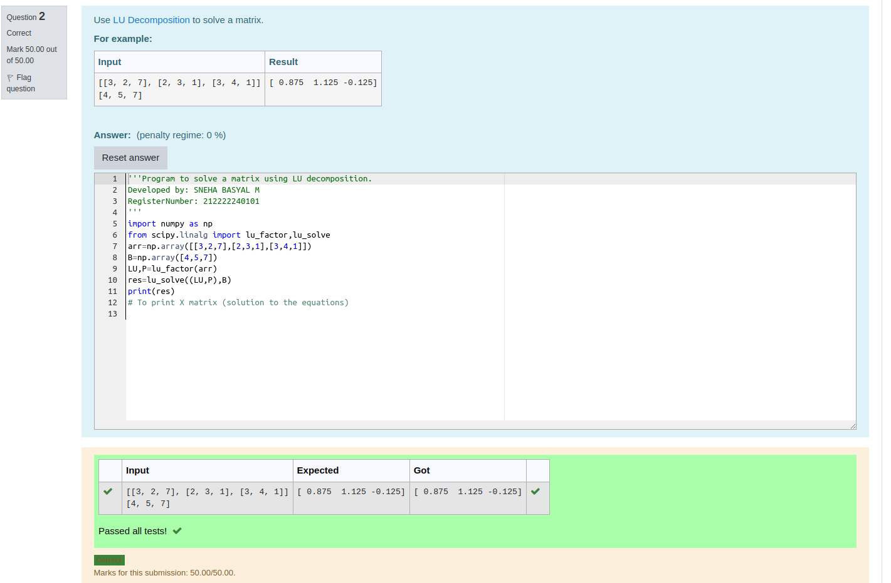

# LU Decomposition 

## AIM:
To write a program to find the LU Decomposition of a matrix.

## Equipments Required:
1. Hardware – PCs
2. Anaconda – Python 3.7 Installation / Moodle-Code Runner

## Algorithm
# step 1:
 Import numpy module

# step 2:
 Get input matrice from the user

# step 3:
 Use lu function

# step 4:
 Print L and U matrix

## Program:
(i) To find the L and U matrix
```
/*
Program to find the L and U matrix.
Developed by: Sneha Basyal M
RegisterNumber: 212222240101
*/
 
import numpy as np
from scipy.linalg import lu
arr=np.array(eval(input()))
P,L,U=lu(arr)
print(L)
print(U)
```

(ii) To find the LU Decomposition of a matrix
```
/*
Program to find the LU Decomposition of a matrix.
Developed by: Sneha Basyal M
RegisterNumber: 212222240101
*/

import numpy as np
from scipy.linalg import lu_factor,lu_solve
arr=np.array([[3,2,7],[2,3,1],[3,4,1]])
B=np.array([4,5,7])
LU,P=lu_factor(arr)
res=lu_solve((LU,P),B)
print(res)
# To print X matrix (solution to the equations)
```

## Output:





## Result:
Thus the program to find the LU Decomposition of a matrix is written and verified using python programming.

